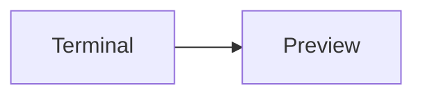
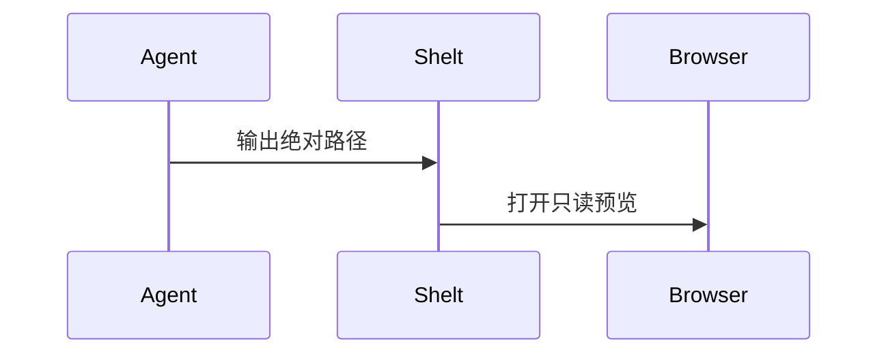
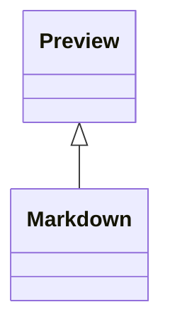
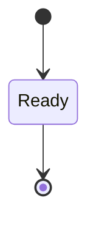
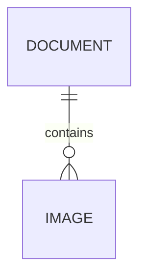

# Shelt Preview 验收

这是一段 **Markdown**，包含中文路径、表格、代码和相对图片。

| 类型 | 状态 |
| --- | --- |
| Markdown | 正常 |
| Mermaid | 正常 |

```mermaid
flowchart LR
  Terminal --> Preview
```

```mermaid
sequenceDiagram
  Agent->>Shelt: 输出绝对路径
  Shelt->>Browser: 打开只读预览
```

```mermaid
classDiagram
  Preview <|-- Markdown
```

```mermaid
stateDiagram-v2
  [*] --> Ready
  Ready --> [*]
```

```mermaid
erDiagram
  DOCUMENT ||--o{ IMAGE : contains
```

